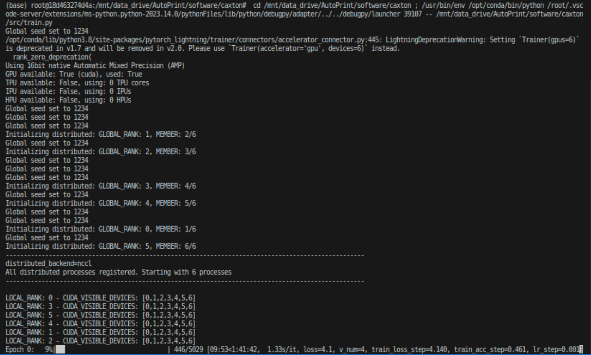
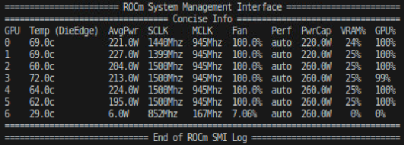

__Notes/ Changes from the original repository:__  
- Great use case for the work of [Wang, et.al. (2017)](https://arxiv.org/pdf/1704.06904.pdf) -- as also indicated in the paper as reference #58. There are quite similar code examples on GitHub. Just check [paperswithcode](https://paperswithcode.com/paper/residual-attention-network-for-image) of Wang, et.al.  
- An easy method to download the dataset is not provided. An updated list of the dataset programmatically and as .tsv files in [data utils](./data/utils) folder.  
- Setup is changed to conda due to the lack of explanation in the core setup requirement (e.g., python version). Different Python versions result in conflicts.  
- Review is added from supplementary information of Nature into the [supplementary_information](./supplementary_information/) folder.  
__To Dos:__  
[ ] Check the algorithmic logic of correction (classification to process parameters). It seems to be an on/off-like approach (linearly mapped between threshold limits) and this approach will require additional tuning due to potential oscillations as pointed out in 'Online correction and parameter discovery pipeline' and Fig. 3-b as well.  
[ ] Benchmarks with others. 😉  

# CAXTON: The Collaborative Autonomous Extrusion Network

_Accompanying code to the publication "[Generalisable 3D Printing Error Detection and Correction via Multi-Head Neural Networks](https://www.nature.com/articles/s41467-022-31985-y)"_


## ⚙️ Setup

This repository allows you to easily train a multi-head residual attention neural network to classify the state of the four most important printing parameters: flow rate, lateral speed, Z offset, and hot-end temperature from a single input image.

First, create a Python 3 virtual environment and install the requirements - this should only take a couple of minutes. We used PyTorch (v1.7.1), Torchvision (v0.8.2), and CUDA (v11.3) in this work. See the complete list of requirements in `requirements_ori.txt`. 

```
virtualenv -p python3 env
source env/bin/activate
pip install -r requirements.txt
```

The following setup is specifically for the [target hardware -- (a) in the 3.1 Hardware](https://github.com/bankh/GPU_Compute#31-hardware). Based on the hardware that one might have the setup might need to change.  

- Pull and run Docker container (see [Docker instructions for ROCm](https://github.com/bankh/GPU_Compute/blob/main/Docker_images/AMD/readMe.md)).  
```
$ docker pull rocm/pytorch:rocm5.4_ubuntu20.04_py3.8_pytorch_1.12.1
$ docker run -it --name caxton_1 \
                 --cap-add=SYS_PTRACE \
                 --security-opt seccomp=unconfined \
                 --device=/dev/kfd --device=/dev/dri \
                 --group-add $(getent group video | cut -d':' -f 3) \
                 --ipc=host \
                 -v /mnt/data_drive:/mnt/data_drive -v /mnt/data:/mnt/data -v /home/ubuntu:/mnt/ubuntu \
                 -p 0.0.0.0:6007:6007 \
                 -e DISPLAY=$DISPLAY -v /tmp/.X11-unix:/tmp/.X11-unix:ro \
                 rocm/pytorch:rocm5.4_ubuntu20.04_py3.8_pytorch_1.12.1
```

- Inside the docker container, download and install Miniconda.  
```
$ curl -O https://repo.anaconda.com/miniconda/Miniconda3-latest-Linux-x86_64.sh ## https://repo.anaconda.com/miniconda/Miniconda3-4.7.12.1-Linux-x86_64.sh # Python 3.6
$ chmod +x Miniconda3-latest-Linux-x86_64.sh
$ bash Miniconda3-latest-Linux-x86_64.sh
```

- Create and activate the virtual environment.  
```
$ conda create --name pytorch1120 python=3.6 -y
$ conda activate pytorch1120
```

- Install the requirements (changed from the original one without torch and torchvision).  

```
$ pip install -r requirements.txt
```

- Training proceeds smoothly with 6 GPUs. However, utilizing a 7th GPU could potentially trip a 20A breaker. If everything operates as expected, the following output will appear on the terminal:  
 
<table style="width:100%;">
    <tr>
        <td style="width:50%;"></td>
        <td style="width:50%;"></td>
    </tr>
</table>


## 🏃 Usage

Inside the `src` directory are two sub-directories for our `data` and `model`. We use Pytorch-Lightning (v1.1.4) as a wrapper for both the dataset and datamodule classes and for our model.

Various settings can be configured inside the `src/train_config.py` file such as the number of epochs, learning rate, number of GPUs, batch size, etc. Also in this file are the pixel channel means and standard deviations used to normalize the image data during training. 

To train the network use the following line:

```
python src/train.py
```

The command line arguments `-e` for the number of epochs and `-s` for the seed can be easily added to the above command.

After training the network is able to simultaneously predict the classification of the four parameters from a single input image with an average accuracy of 84.3%.


The network successfully self-learns the important features in the images during training, and attention maps aid in focusing on the latest extrusion for making predictions. Here we show example attention masks at each module for the given input images. Each module output consists of many channels of masks, only a single sample is shown here. The masks show regions the network is focussing on, such as the most recent extrusion as shown by the output of module 2.


<table style="width:100%;">
    <tr>
        <td style="width:35%;">In the publication, we provide a three-step transfer learning process to achieve high accuracies in this problem. It should be noted that this step is not necessary and training can be completed in an end-to-end fashion with a single training regime.</br>
The three-step learning process is depicted in Fig. 2(d) (as seen on the right) and in the result sections of the paper.</td>
        <td style="width:65%;"></td>
    </tr>
</table>


## Results from samples in the repo

The results for the models in this work were trained on a workstation running Ubuntu 18.04 equipped with an i9-9900K, 64GB RAM, and 2x Nvidia Quadro RTX 5000 GPUs.

In the top-level `data` directory there are 8 cropped and full sample images of different parameter combinations for a range of prints. These are labeled `sampleABCD.jpg` where each of A, B, C, and D are numbers 0, 1, and 2 corresponding to low, good, and high levels respectively. Each letter is for the four different parameters: A - Flow rate, B - Lateral speed, C - Z offset, D - Hotend temp.

You can test these samples with the provided script and should receive an output similar to the one below. On our system iterating through each sample individually takes around 0.07s per sample. Naturally, if the batch size is increased the rate per sample can be greatly increased.

```bash
python src/samples.py

********* CAXTON sample predictions *********
Flow rate | Lateral speed | Z offset | Hotend
*********************************************
Input: sample1221.jpg -> Prediction: [1 2 2 1]
Input: sample2122.jpg -> Prediction: [2 1 2 2]
Input: sample1111.jpg -> Prediction: [1 1 1 1]
Input: sample0022.jpg -> Prediction: [0 0 2 2]
Input: sample2011.jpg -> Prediction: [2 0 1 1]
Input: sample0021.jpg -> Prediction: [0 0 2 1]
Input: sample2120.jpg -> Prediction: [2 1 2 0]
Input: sample1011.jpg -> Prediction: [1 0 1 1]
Completed 8 predictions in 0.56s
```
